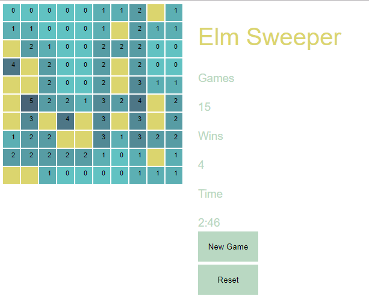

# Elm Sweeper

## A Side Project
I've been meaning to code my own Mine Sweeper for a long time now. I stumbled on Elm recently and saw the [Flatris clone](https://github.com/w0rm/elm-flatris), (which I borrowed from heavily). This inspired me to build Mine Sweeper and learn Elm. This is the result of that effort (although a work in progress).

## Instructions to Run
1. Install [Elm](https://elm-lang.org/install)
1. Clone this repo and `cd` into it
1. Run `elm make src/Main.elm --output=elm.js`
1. Open `index.html` with a browser

## Grading
If you're wondering what the Grade is on the right hand panel, this is something that (as far as I know). Is unique to my version of Mine Sweeper. I won't go into the gory details but looks at where you are on the normalized bell curve given the number of wins and games played. This is done making the assumption that give finding a 0 on the first click that the game can be solved without any further guessing. This is not always the case but I think it is better grading performance than mere win-loss ratio alone.
